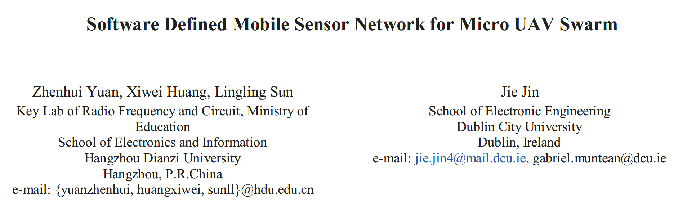

## 用于微型 UAV 集群的软件定义移动传感器网络

摘要：这篇文章介绍了一种作用于微型无人车集群的新型的移动传感器网络，所讲述的网络架构目的是： **增强无人机之间的数据传输性能** 。其中的软件定义网络的核心作用是 **<u>解放 MAV 结点本身的计算负担，并且将网络管理操作转移到云端的软件定义网络控制器上，从而提升无线信道的利用率</u>** 。

### 1. 介绍

一般来说， MAV 集群中的通信是依靠自组织网络完成的。

> AdHoc网络：它是一种自治的无线多跳网，整个网络没有固定的基础设施，也没有固定的路由器，所有节点都是移动的，并且都能以任意方式动态地保持与其它节点的联系。在这种环境中，由于终端的无线覆盖范围的有限性，两个无法直接进行通信的用户终端可以借助于其它节点进行分组转发。每一个节点都可以说是一个路由器，它们要能完成发现和维持到其它节点路由的功能。

但是传统的自组织网络是为了传统的地面无人车设计的，这种设计不能满足无人机的环境，比如说动态的海拔高度，快速拓扑寻路的一系列需求。

总而言之，路由协议是 UAV 集群的通信核心技术。

在这个情况下， 软件定义网络引起了很多人的注意， 软件定义网络提供了对每个网络结点的可编程接口，并且使用中央式或者分布式控制器来管理整个网络。

软件定义网络首先部署在一个中心化的数据中心上，并且对使用 OpenFlow 标准协议的网络设备提供灵活的适应性策略。

### 2. 解决方案的架构

举个例子来说。远程控制中心为无人机集群部署了一系列任务。这时集群的软件定义控制器需要管理无人机之间的通信和网络搭建，比方说路由策略。软件定义无人机结点监测自己的无线网络状态和统计飞行数据，并且将飞行数据传回软件定义网络的控制器；与此同时还要兼顾向其他无人机传送数据包。每个 MAV 无人机结点同时使用 LTE 网络和 WiFi 网络，使用 LTE 网络完成控制中心和无人机之间的数据传输，使用 WiFi 网络完成无人机之间的信息传输。两种网络完成传输的方式增强了整体的性能。

当前设计的系统的核心就是这个控制中心，控制中心中维护着 **全局路由表** 。路由表中包含无人机各种信息，最核心的信息就是 IP 地址，以及互相之间的跳数等等。

这个软件定义网络的设计主旨就是为了注重无人机终端的有限算力，将复杂的路由计算转移到中心化的云端服务器上，然后使无人机可以使用全部的资源来进行数据传输和交换。

### 3. 硬件设施

一个典型的 MAV 系统包括 3 个最基本的模块，自动飞行控制器，导航模块 以及 网络通信单元。

### 4. 相关工作

### 5. 结论

这个假定的，基于软件定义网络的移动传感器网络主要是为了解决传统无人机网络算力不足的问题。将复杂的路由计算转移到云端的计算中心，这样就大大降低了无人机的运算负担，可以将全部的算力用来通信和采集用户任务数据。

