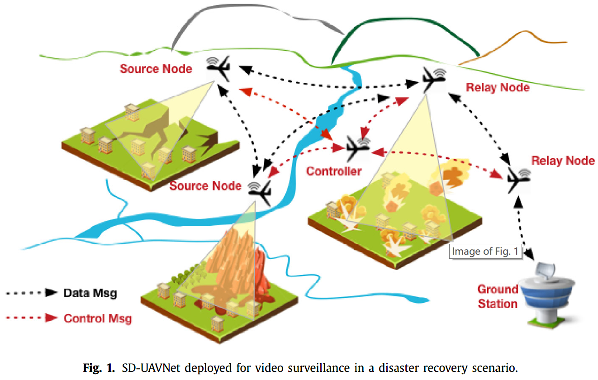

# 软件定义的视频分发无人机网络设计

**<u>摘要</u>** ：UAV 网络的特点是具有很高的动态性，不稳定的空中无线连接，以及可能会发生撞车的事件。为了针对这个问题，本文设计了一个软件定义的无人机网络。并且，在特定的环境下，这个网络架构还能评估出放置视频转发中继装备的最佳安放位置。

在这个网络中，中央控制器掌控全局的无人机信息用来优化无人机的移动，路径选择从而避免无人机撞车；以及决定视频中继的放置位置以保证视频质量。

## 1. 引言

SDN has been successfully applied in wired networks, such as data center networks or backbone networks. 

软件定义网络已经在有限网络中得以很好的应用。并且特别是，这些网络都是中心化架构的，网络的中心控制器管理着整个网络。控制器部署在控制中心，掌握全局信息的同时，还会动态的规划数据层的路由。

本文所做的研究就是设计一个软件定义的无人机网络架构。这个网络践行软件定义网络的核心思想，即将控制层和数据层分离，并且提供可编程的接口来控制无人机的参数设置。

在这个基础上，再专注于解决无人机的视频中继转发结点的选址问题，以求得最好的视频转发质量。

控制中心考虑全局 UAV 的路径选择，路径优化等等从而避免撞车的发生。

本文的贡献可以总结如下：

* 一个软件定义的无人机网络架构，包括一个中心化的可编程网络控制器；
* 视频应用，如何选择最优的视频中继转发结点的地点；
* 能源监控；
* 一个模拟实验来证明本文的设计是可行的。

## 2. 相关工作

## 3. 软件定义的视频分发无人机网络

我们将部署在网络上的无人机形成的网络看作一个「图」，每个无人机相当于图的顶点，无人机之间的通信相当于图的边。

在网络中的控制结点不仅仅负责中继结点的位置选择，还要设置全部的无人机飞行参数（速度，运动模式等等）。控制结点可以是一个地面基站，也可以是一个常规的无人机结点。

每个无人机都能评估自己剩余的电量。

* 控制结点是整个网络的核心部件。其负责维护和更新网络的拓扑结构使得无人机能够互相通信，建立路由，并且调整 UAV 的位置让数据包更好地进行传输。
* 源结点负责拍摄，然后将视频编码，最后向目标结点传送。
* 中继结点负责向目标结点接力转发数据包，它们的位置和行动模式由控制结点决定。
* 目标结点也就是地面基站，也就是接受数据包然后将其解码称为画面。

