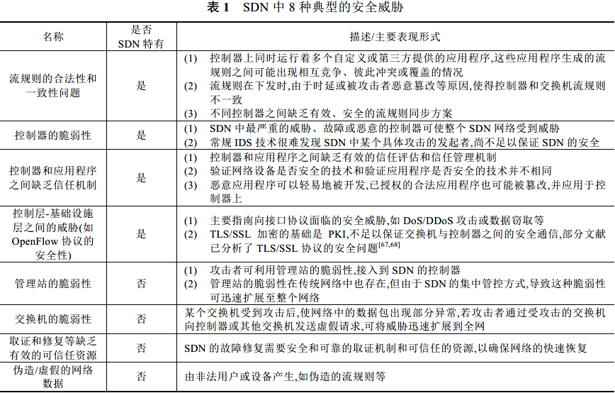

# 软件定义网络:安全模型、机制及研究进展

>   摘要：软件定义网络( Software Defined Networking ,简称 SDN )初步实现了网络控制面与数据面分离的思想。然而在提供高度开放性和可编程性的同时,网络自身也面临着诸多安全问题。

>   中文引用格式: 王蒙蒙,刘建伟,陈杰,毛剑,毛可飞.软件定义网络:安全模型、机制及研究进展.软件学报,2016,27(4):969-992.http://www.jos.org.cn/1000-9825/5020.htm
>
>   英文引用格式: Wang MM, Liu JW, Chen J, Mao J, Mao KF. Software defined networking: Security model, threats and mechanism. Ruan Jian Xue Bao/Journal of Software, 2016,27(4):969-992 (in Chinese). http://www.jos.org.cn/1000-9825/5020.htm

软件定义网络( Software Defined Networking,简称 SDN ),将传统封闭的网络体系解耦为数据平面、控制平面和应用平面,在逻辑上实现了网络的集中控制与管理. SDN 的突出特点是开放性和可编程性。

**逻辑上的集中控制** 和 **数据转发分离** 是 SDN 架构的基本思想。

SDN 将网络的控制平面从嵌入式节点中独立出来，以开放、可编程的软控制平面代替了传统的基于系统嵌入的控制平面,并由软件驱动的中央控制器来控制整个网络。这种结构导致了单点失效、南/北向接口协议的安全性难以控制等问题。此外, SDN 动态、开放的可编程架构也间接地为攻击者提供了便捷、有效的攻击手段和方式。

SDN 的安全防护面临更多挑战,主要体现在：

1.  集中式的管控架构使得SDN的“智慧”集中在控制器上,控制器能够实时地获取网络的全局信息,并通过南向接口将网络配置和安全服务等控制信息下发到交换机和其他网络设备中,从而实现对全网的统一管控。
2.  可编程性是 SDN 实现统一管理、配置网络设备的重要依托,但同时它也为攻击者提供了便捷的攻击渠道。
3.  由于交换机会将无法匹配的流请求信息均发送至控制器,由控制器为其提供相关的应答策略,这种工作模式极大地增加了控制器遭受 DoS / DDoS 攻击的可能性。
4.  由于 SDN 的网络状态和配置信息动态变化,网络中的信息流是否流经某个安全设备以及何时流经该安全设备,这些均由控制器下发的流规则决定。如果攻击者能够伪造来自控制器的流规则,便能够控制网络流量的路径，进而绕开 SDN 中部署的各种安全设备。

## 1. SDN 架构与安全模型

在RSA 2014 会议上, Check Point 公司的代表 Hinden 从物理设备无法主动执行安全操作、应用层和控制层之间的信任关系匮乏等方面对其进行了简要分析,并提出了全网统一的安全策略、控制与安全相关的信息流、隔离受感染的主机等应对方法。

### 1.1 SDN 架构简介

SDN 架构的核心思想是 **<u>逻辑上集中控制</u> 和 <u>数据转发</u> 分离** 。

ONF 提出的 SDN 架构主要分为 基础设施层、 控制层 和 应用层 .

*   基础设施层由网络底层的转发设备组成,主要负责数据的处理、转发和状态收集； 
*   控制层集中维护网络状态。一方面,它通过自身与基础设施层之间的接口获取底层基础设施信息,对数据平面的资源进行编排;另一方面,它对全网的拓扑和状态等信息进行实时维护,并为应用层提供可扩展的编程接口。
*   应用层位于SDN 架构的顶层,主要包括不同类型的业务和应用。

由于应用层中各类业务和应用的复杂性和多样性,控制层与应用层之间的北向接口目前尚无统一的规范和标准。

### 1.2 基于 OpenFlow 的 SDN 工作流程

1.  终端A 加入网络,并向交换机1 发送数据包；
2.  交换机1 查询自身的流表,若流表中没有与该数据包匹配的表项,则交换机1 通过Packet-In 事件将该数据包转发给控制器.在向控制器发送消息时,交换机1 可以通过TCP 协议直接将数据包发送给控制器,也可以采用安全传输层协议(transport layer security,简称TLS)对数据包进行加密传送；
3.  控制器收到交换机1 的请求信息后,生成相应的应答策略,并通过Packet-Out 事件下发至交换机1的指定端口；
4.  交换机1 执行控制器下发的应答策略,将数据包转发至交换机2 ；
5.  若交换机2 的流表中无该数据包匹配项,与Step 2 处理方式相似,交换机2 将通过Packet-In 事件把收到的数据包信息转发给控制器;若交换机2 的流表中含有匹配项,则跳转至Step 7,即交换机2 按流表中相应的转发规则将数据包转发至终端B；
6.  与Step 3 相似,控制器根据交换机2 的请求信息,下发相应的应答策略至交换机2 的指定端口；
7.  交换机2 执行控制器下发的应答策略,数据包被转发至终端B。

### 1.3 SDN 安全模型与传统网络安全模型对比

集中管控使得控制器对网络流量具有极强的控制能力，但这种工作模式也给网络的安全模型带来了较大冲击,主要体现在两个方面：

1.  **SDN 与传统网络对信息流的控制方式不同** ：在传统网络环境中，防火墙等安全设备被部署在网络的关键位置,信息流被强制性地从这些安全设备中流过,以便安全设备可以对其进行实时监控和检测。SDN 中的信息流是否流过某个安全设备以及何时流过该安全设备,均由控制器下发的流规则决定,物理的安全设备自身并不具有决定权。故不安全的数据流可能会因为转发规则而绕过防火墙；
2.  **SDN 与传统网络对网络安全态势信息的获取方式不同** ：在传统网络中当管理员需要获取当前网络的安全态势信息时，需要同时向多个设备发送状态请求信息,在对收到的状态信息进行综合评估后,才能得出网络当前的安全态势信息。而在 SDN 中，控制器掌握着网络的全局信息，也就是说网络管理员只需要向控制器发出信息即可。

## 2. SDN 典型安全问题分析

### 2.1 SDN特有/非特有的典型安全问题

### 2.2 SDN各层/接口面临的安全问题

*   应用层安全 : 针对应用程序自身的安全性保护机制并不健全,由于基础设施层的各种交换机和网络设备对控制器下发的流规则完全信任,且不假思索地执行,一旦这些参与制定流规则的应用程序受到篡改和攻击,将给SDN 带来难以预估的危害;
*   控制层安全 : 控制器是SDN 的核心,也是安全链中最薄弱的环节. SDN 通过控制器对网络进行集中管控,接入到控制器的攻击者,将有能力控制整个网络,进而给 SDN 带来难以预估的危害；
*   基础设施层安全 ： 基础设施层由交换机等一些基础设备组成,主要负责数据的处理、转发和状态收集,对控制器下发的流规则绝对信任，这就是最大的威胁；
*   南向接口安全 ： 这主要是指由 OpenFlow 协议的脆弱性而引发的安全性威胁；
*   北向接口安全 ： 标准化问题。

## 3. SDN 安全机制

### 3.1 SDN安全控制器的设计与开发

控制器是 SDN 的核心,它对整个网络的状态和拓扑等信息进行集中管控,一旦受到攻击,会导致 SDN 网络的大面积瘫痪。因此,完善的安全机制对 SDN 控制器而言尤为重要。按照控制层的基本架构,可将现有控制器分为 **集中式** 和 **分布式** 两类。

目前,在 SDN 安全控制器的设计和开发方面,现有的研究思路可以归纳为两类: **<u>演进式安全控制器的开发</u>** 和 **<u>革命式安全控制器的开发</u>** 。

*   演进式安全控制器的主要研发思路是在现有开源控制器的基础上,改进已有的安全服务或开发部署新的安全模块。

但是，针对现有控制器中存在的各种安全问题,通过附加安全机制或修补安全漏洞的方式,使得研究者和开发人员比较被动,很难在短时间内有效提升控制器的安全性。于是，研究人员开始着手研究全新的，从设计初始就安全性定为主要因素的控制器（革命式安全控制器）。

*   革命式安全控制器的开发：一些研究者提倡在SDN 控制器的设计和开发之初,便将安全性作为其核心问题之一进行考虑,从而突破已有控制器在系统架构、编程语言和预留接口等方面的限制,开发出全新的、内嵌安全机制的 SDN 控制器,以较好地提高 SDN 控制器的安全性能。

在由分布式控制器构成的SDN 网络中,由于不同控制器之间进行通信的东西向接口尚无明确的安全标准,分布式控制器在安全通信和资源调度方面均面临着诸多安全挑战。

### 3.2 可组合安全模块库的开发和部署

控制器的安全是 SDN 网络能够安全运行的基础. SDN 通过控制器对网络进行集中管控,这种工作模式虽然在安全策略的细粒度、实时推送和流量监控等方面具有较大优势,但同时也使得控制器成为被攻击的焦点.因此,在控制器上开发和部署相应的可组合安全模块库,通过这些安全模块库的相互组合和协作,不断增强控制器的安全防护能力,是SDN 安全的一个重要研究方向。

### 3.3 控制器 DoS / DDoS 攻击防御

DoS/DDoS 攻击主要是指 **<u>攻击者通过傀儡主机消耗攻击目标的计算资源,阻止目标为合法用户提供服务</u>** 。针对SDN 控制器面临的DoS/DDoS 攻击问题,现有解决方案的主要思路分为 3 种：

1.  基于流量变化特征对控制器 DoS/DDoS 攻击行为进行检测;
2.  基于连接迁移机制对 DoS/DDoS 攻击进行防范;
3.  基于STRIDE、UML 等威胁建模方法,对SDN 中潜在的DoS/DDoS 攻击行为进行评估和预测;

### 3.4 流规则的合法性和一致性检测

SDN 是典型的流规则驱动型网络,流规则的合法性和一致性是保证 SDN 正常、有效运行的基础。

流规则是SDN 交换机执行转发、数据包处理等操作的依据.由于基础设施层的网络设备对控制器下发的流规则完全信任,一旦由虚假控制器或恶意应用程序提供的流规则被执行,将使SDN 的安全性面临严重威胁。

针对SDN 中流规则的合法性和一致性检测问题,目前研究者给出的解决方案的主要思路包括两种：

1.  基于应用程序的角色和优先级,对流规则的等级进行划分；
2.  采用形式化和数学分析方法,对不同流规则之间的一致性和冲突性进行分析；

### 3.5 北向接口的安全性

在SDN 控制层和应用层的安全交互方面,北向接口的安全性扮演着重要角色. **<u>目前,现有的各类控制器并没有为北向应用程序提供标准化的安全接口</u>** 。为满足不同控制器的安全需求,开发人员需根据控制器类型的不同,重新对应用程序及其接口进行开发.由于与控制器进行交互的应用程序种类多样,版本也在不断更新,攻击者可通过北向接口的安全漏洞直接向控制器发起攻击,从而使得SDN 控制器对应用程序的认证和安全管理等工作变得更加复杂。

### 3.6 应用程序安全性

在 SDN 网络中,应用程序自身的安全性主要是指 **<u>SDN 核心设备中的一些应用程序本身是否存在安全漏洞,以及这些应用程序是否会因为受到某些攻击而使得 SDN 中一些关键信息的安全性受到威胁</u>** 。

由于目前SDN 网络的部署和应用仍处于初级阶段,大多数用户和开发者在判断某个应用程序是否符合要求时,通常偏重于应用程序的功能性验证,而忽略或较少考虑应用程序自身的安全性验证,再加上 SDN 的开放性和可编程性特征,使得攻击者在很多情况下都能有机可乘。

## 4. SDN 安全的标准化工作进展

SDN 作为一种新型的网络架构,其安全标准又涉及SDN 架构的安全性、控制器的安全性、南/北向接口协议的安全性、应用程序的安全性等多个方面。 **<u>因此,截止到目前为止,国内外尚未有明确的关于 SDN 安全方面的行业标准被正式发布</u>** 。

## 5. 结论与展望

未来 SDN 的安全研究还将重点关注以下几个方面：

1.  面向安全的新型控制器/网络操作系统的设计与开发：如何设计更加安全的网络控制器？
2.  控制器跨域协同安全通信问题：控制器之间的通信如何保证安全？
3.  北向接口安全协议的标准化：北向接口使得控制层对应用层更加开放,攻击者可通过北向接口间接实现对控制器的攻击,从而增加了北向接口遭受攻击的可能性。
4.  控制器 DoS/DDoS 攻击检测与防范技术。

